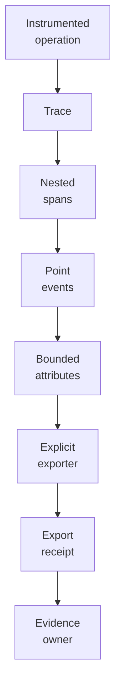
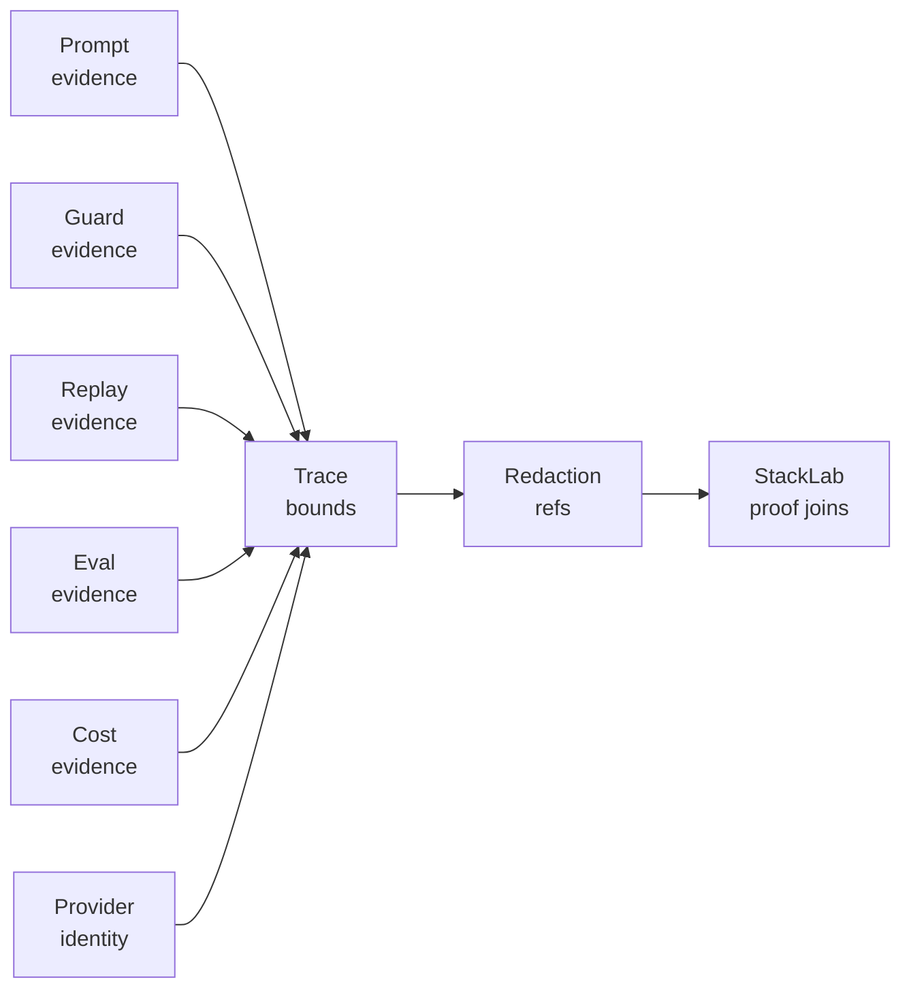

<p align="center">
  
</p>

<p align="center">
  <a href="https://github.com/nshkrdotcom/AITrace">
    
  </a>
  <a href="https://github.com/nshkrdotcom/AITrace/blob/main/LICENSE">
    
  </a>
</p>

# AITrace

> The unified observability layer for the AI Control Plane.

`AITrace` provides the unified observability layer for the AI Control Plane, transforming opaque, non-deterministic AI processes into fully interpretable and debuggable execution traces.

Its mission is to create an Elixir-native instrumentation library and a corresponding data model that captures the complete causal chain of an AI agent's reasoning process—from initial prompt to final output, including all thoughts, tool calls, and state changes—enabling a true "Execution Cinema" experience for developers and operators.

Standalone tracing may use the `:aitrace, :exporters` application config.
Governed callers must pass explicit exporters to `AITrace.export/2`; ambient
application env must not select trace export sinks for governed evidence.

## Stack Position

AITrace is an evidence and observability library, not the authority layer. In
the ranked stack it provides trace refs, spans, events, replay bundles, export
receipts, and execution-cinema data that other owners can join to their own
truth:

```text
products, AppKit, Mezzanine, Citadel, Jido Integration, StackLab
  -> AITrace spans/events/export receipts
      -> Mezzanine owns durable audit truth
      -> Citadel owns authority truth
      -> StackLab owns assembled proof joins
```

This distinction matters. A trace can prove what was observed by an
instrumented path. It does not by itself prove that the path was authorized,
that a workflow reached durable terminal truth, or that a release claim is
closed. Those claims need the owning authority, audit, and proof repos to link
AITrace refs into their receipts.

## Current Platform Role

The current package still supports the simple local tracing API shown below,
but it now also carries stack-oriented evidence contracts:

- bounded export behavior that redacts raw prompt, provider, webhook, payload,
  and oversize fields into hash-backed spillover refs
- file-export receipts that can carry release-manifest or evidence-owner refs
- authority-trace classification helpers
- AI platform trace bounds for prompt, guard, replay, eval, cost, and provider
  identity evidence
- replay contracts and replay engine packages under `core/`
- single-node proof trace fixtures used by StackLab
- persistence posture documentation for redacted memory/ref-only capture

Use ambient application config only for standalone tracing. Governed callers
must pass explicit exporters and refs at the call site so export sinks are not
silently selected by process configuration.

## Trace Diagrams





## The Problem: Why Traditional Observability Fails

Debugging a simple web request is a solved problem. We have structured logs, metrics, and distributed tracing (like OpenTelemetry) that show the path of a request through a series of stateless services.

Debugging an AI agent is fundamentally different. It is like performing forensic analysis on a dream. The challenges are unique:

*   **Non-Determinism:** The same input can produce different outputs and, more importantly, different *reasoning paths*.
*   **Deeply Nested Causality:** A final answer may be the result of a multi-step chain of thought, where an LLM hallucinates, calls the wrong tool with the wrong arguments, misinterprets the result, and then tries to correct itself.
*   **Stateful Complexity:** Agents are not stateless. Their behavior is conditioned by memory, scratchpads, and the history of the conversation. A simple log line is insufficient to capture the state that led to a decision.
*   **Polyglot Execution:** An agent's "thought" may happen in Elixir, but its "action" (e.g., running a code interpreter) happens in a sandboxed Python environment. Tracing this flow across language boundaries is notoriously difficult.

`Logger.info/1` is inadequate. Traditional APM tools provide a high-level view but lack the granular, AI-specific context needed to answer the most important question: **"Why did the agent do *that*?"**

## Core Concepts & Data Model

`AITrace` is built on a few simple but powerful concepts, heavily inspired by OpenTelemetry but adapted for AI workflows.

*   **Trace:** The complete, end-to-end record of a single transaction (e.g., one user message to an agent). It is identified by a unique `trace_id`. A trace is composed of a root `Span` and many nested `Spans` and `Events`.

*   **Span:** A record of a timed operation with a distinct start and end. A span represents a unit of work. Examples: `llm_call`, `tool_execution`, `prompt_rendering`. Spans can be nested to represent a call graph. Each span has a `name`, `start_time`, `end_time`, and a key-value map of `attributes`.

*   **Event:** A point-in-time annotation within a `Span`. It represents a notable occurrence that isn't a timed operation. Examples: `agent_state_updated`, `validation_failed`, `tool_not_found`.

*   **Context:** An immutable Elixir map (`%AITrace.Context{}`) that carries the `trace_id` and the current `span_id`. This context is explicitly passed through the entire call stack of a traced operation, ensuring all telemetry is correctly correlated.

## Installation

Add `aitrace` to your `mix.exs` dependencies:

```elixir
def deps do
  [
    {:aitrace, "~> 0.1.0"}
  ]
end
```

## Quick Start

```elixir
defmodule MyApp.Agent do
  require AITrace  # Required to use the macros

  def handle_user_message(message, state) do
    # 1. Start a new trace for the entire transaction
    AITrace.trace "agent.handle_message" do
      # 2. Add point-in-time events with rich metadata
      AITrace.add_event("request_received", %{message_length: String.length(message)})

      # 3. Wrap discrete, timed operations in spans
      response = AITrace.span "reasoning_loop" do
        # Add attributes to the current span
        AITrace.with_attributes(%{model: "gpt-4", temperature: 0.7})

        # Perform reasoning
        think_about(message)
      end

      AITrace.add_event("reasoning_complete", %{token_usage: response.tokens})

      {:reply, response.answer, update_state(state)}
    end
  end
end
```

## Core API

### Starting a Trace

```elixir
AITrace.trace "operation_name" do
  # Your code here - context is stored in process dictionary
end
```

### Creating Spans

```elixir
AITrace.span "span_name" do
  # Timed operation - duration is automatically measured
end
```

### Adding Events

```elixir
AITrace.add_event("event_name", %{key: "value"})
AITrace.add_event("simple_event")  # No attributes
```

### Adding Attributes

```elixir
AITrace.with_attributes(%{user_id: 42, region: "us-west"})
```

### Accessing Context

```elixir
ctx = AITrace.get_current_context()
IO.inspect(ctx.trace_id)
IO.inspect(ctx.span_id)
```

### Direct Trace Export

```elixir
trace =
  %AITrace.Trace{trace_id: "trace_123", created_at: 1_712_345_678_000_000, spans: [], metadata: %{}}

AITrace.export(trace)
```

This one-shot path is intended for integrations that already have a completed
`AITrace.Trace` value and want to run it through the configured exporters
without using the collector-backed macros.

## Configuration

Configure exporters in your application config:

```elixir
# config/config.exs
config :aitrace,
  exporters: [
    {AITrace.Exporter.Console, verbose: true, color: true},
    {AITrace.Exporter.File, directory: "./traces"}
  ]
```

### Available Exporters

*   **`AITrace.Exporter.Console`** - Prints human-readable traces to stdout
  - Options: `verbose` (show attributes/events), `color` (ANSI colors)

*   **`AITrace.Exporter.File`** - Writes JSON traces to files
  - Options: `directory` (output directory, default: "./traces"),
    `release_manifest_ref`, `evidence_owner_ref`, `source_node_ref`,
    `node_instance_id`, `boot_generation`, `node_role`, `deployment_ref`,
    `cluster_ref`, `commit_lsn`, `commit_hlc`
  - The file exporter writes an adjacent `.evidence.json` receipt containing
    the trace artifact SHA-256, byte count, release-manifest or evidence-owner
    linkage, and proof posture. Trace data is not authoritative audit,
    incident, replay, review, or release-manifest proof unless the receipt is
    anchored by `release_manifest_ref` or an existing `evidence_owner_ref`.
  - When `source_node_ref` is configured, the trace JSON, every exported span,
    and the adjacent evidence receipt include per-node evidence. If `commit_lsn`
    and `commit_hlc` are also configured, the receipt includes
    `node_order_evidence` keyed by `trace_id` for proof-token joins.
  - Exported metadata and attributes are bounded by
    `AITrace.ExportBounds`; raw prompt/provider/webhook/payload-shaped fields
    and oversize values are replaced with SHA-256 spillover refs instead of
    being serialized inline.
  - Phase 7 capture posture defaults to a redacted memory/ref-only evidence
    profile. `:off` capture disables trace retention without blocking provider
    effects, and debug tap failure records `:failed_non_mutating` evidence
    without mutating trace, span, event, export, or replay-bundle state.

### Creating Custom Exporters

Implement the `AITrace.Exporter` behavior:

```elixir
defmodule MyApp.CustomExporter do
  @behaviour AITrace.Exporter

  @impl true
  def init(opts), do: {:ok, opts}

  @impl true
  def export(trace, state) do
    # Send trace to your backend
    IO.inspect(trace)
    {:ok, state}
  end

  @impl true
  def shutdown(_state), do: :ok
end
```

## Examples

See `examples/basic_usage.exs` for a complete working example:

```bash
mix run examples/basic_usage.exs
```

Output:
```
Trace: b37b73325dbd626481e0ff3e89de02c8
▸ reasoning (10.84ms) ✓
  Attributes: %{model: "gpt-4", temperature: 0.7}
    • reasoning_complete
      %{thought_count: 3}
▸ tool_execution (5.95ms) ✓
  Attributes: %{tool: "web_search"}
▸ response_generation (8.98ms) ✓
  Attributes: %{tokens: 150}
```

## Architecture

### Data Model

- **AITrace.Context** - Carries trace_id and span_id through the call stack
- **AITrace.Span** - Timed operations with start/end times, attributes, and events
- **AITrace.Event** - Point-in-time annotations within spans
- **AITrace.Trace** - Complete trace containing all spans

### Runtime

- **AITrace.Collector** - In-memory Agent storing active traces
- **AITrace.Application** - Supervision tree managing the collector
- Context stored in process dictionary for implicit propagation

### Future Integrations

`AITrace` is designed to integrate with other AI infrastructure:

*   **DSPex** - Automatic instrumentation for LLM calls and prompt rendering
*   **Altar** - Tool execution tracing with arguments and results
*   **Snakepit** - Cross-language tracing via gRPC metadata
*   **Phoenix Channels** - Real-time trace streaming to web UIs
*   **OpenTelemetry** - Export to standard observability platforms

## Development Status

**✅ Implemented (v0.1.0)**
- Core data structures (Context, Span, Event, Trace)
- Trace and span macros with automatic timing
- Event and attribute APIs
- Console exporter (human-readable output)
- File exporter (JSON format)
- Comprehensive test suite (80 tests)
- Working examples

**🚧 Planned**
- Phoenix Channel exporter for real-time streaming
- OpenTelemetry exporter
- OTP integration helpers (GenServer, Oban)
- Cross-process context propagation
- "Execution Cinema" web UI with waterfall views
- DSPex, Altar, and Snakepit integrations

## Testing

```bash
# Run all tests
mix test

# Run with coverage
mix test --cover

# Run example
mix run examples/basic_usage.exs
```

## License

MIT - See [LICENSE](LICENSE) for details.

## Contributing

AITrace is part of the AI Control Plane ecosystem. Contributions welcome!

## Persistence Documentation

See `docs/persistence.md` for tiers, defaults, adapters, unsupported selections, config examples, restart claims, durability claims, debug sidecar behavior, redaction guarantees, migration or preflight behavior, and no-bypass scope when applicable.
